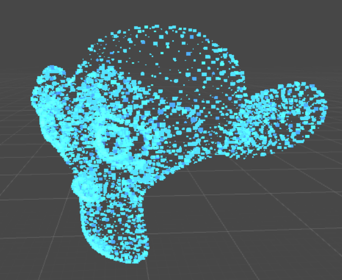

# PointCloudMeshRendering
Renders any mesh as a point cloud in unity.

* Includes a shader with randomized offset and size for each "point".
* Points are masked with a texture (square in this case).
* Blending is additive

